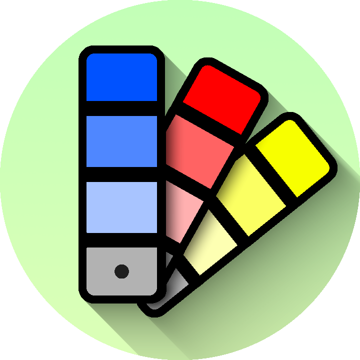

# Color-Finder
## About
A very simple app for finding the color palette of an image based on Google's Material Design color swatches.

## Credits
[Code_r](https://www.geeksforgeeks.org/convert-the-given-rgb-color-code-to-hex-color-code/) for his `decToHexa` and `convertRGBtoHex` functions.

[Jeremy Noesen](https://github.com/jeremynoesen) for the logo design.
